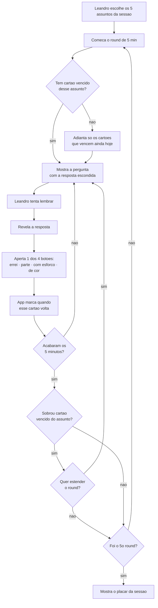

# Requisitos — Flashcards para entrevista de Flutter sênior

_Levantado em 10/08/2026 · Última atualização em 10/08/2026_
_Entrevistado: Leandro Rocha (quem vai estudar e usar o app)_

## Problema e objetivos

Leandro está desempregado e vai passar por **várias entrevistas** para vagas de
desenvolvimento Flutter sênior. Não há data nem quantidade definidas para as
entrevistas — mas ele estabeleceu um prazo para si mesmo: **precisa aprender
tudo em 30 dias, de 10/08/2026 a 09/09/2026.**

Hoje ele estuda por uma lista de perguntas e respostas, tentando decorar, e sente
que **não está dando resultado**: a resposta fica logo abaixo da pergunta, então
ele lê antes de tentar lembrar e nunca descobre o que realmente sabe.

Ele quer um app de cartões de estudo que:

- **Esconda a resposta** e o obrigue a tentar lembrar antes de conferir.
- Dê **sensação de avanço em tempo real** — ver o progresso mexer todo dia foi o
  que faltou na lista que ele usa hoje.
- Encaixe em **1 ou 2 sessões de 25 minutos por dia** — o resto do tempo livre
  ele usa praticando código fora do app.
- Ofereça **4 botões** para ele dizer o quanto acertou.

**Risco que ele quer evitar acima de tudo:** _"não quero correr o risco de
estudar errado e não aprender nada."_ Ou seja: não basta o app parecer que está
funcionando — ele precisa **provar** que está.

**Vamos saber que deu certo quando**, em 09/09/2026, depois dos 30 dias de uso
diário:

1. Leandro **responde sem travar** numa conversa técnica real — as respostas vêm
   na hora, sem branco. É o oposto do que acontece hoje.
2. O **mapa por assunto está quase todo verde**, dando a ele segurança para
   aceitar uma entrevista sem medo.
3. Ele **manteve a rotina** de estudo diária sem abandonar — algo que nunca
   conseguiu com a lista atual.
4. E o objetivo final: **passar numa entrevista** e receber uma proposta.

_Observação: o item 4 depende de fatores fora do app (a vaga, o entrevistador, a
concorrência). Os itens 1 a 3 são os que o app consegue, sozinho, fazer
acontecer._

## Como funciona hoje

Leandro estuda por uma lista escrita de perguntas e respostas, tentando decorar.
A resposta aparece logo abaixo da pergunta, o que estraga o exercício de tentar
lembrar sozinho. Não usa nenhum app de cartões hoje.

**O ritmo que ele quer ter a partir de agora** (está desempregado, com o dia
inteiro livre):

- Sessões de **25 minutos** de estudo concentrado.
- Cada sessão dividida em **5 rounds de 5 minutos** (sessão de 25 minutos), cada
  round dedicado a **um assunto diferente** — e serão **5 assuntos no total**,
  então uma sessão cobre a coleção inteira.
- **1 ou 2 sessões por dia.**

> **Por que não as 6 sessões de 50 minutos que ele imaginou no início:** com 100
> cartões espaçados, só cerca de **33 vencem por dia** — cerca de 17 minutos de
> estudo. Encher 6 sessões de 50 minutos exigiria cada cartão aparecendo 6 vezes
> ao dia, que é o "tudo em horas" descartado por reduzir o ganho de cada revisão.
> Leandro preferiu **reduzir as sessões** a inflar a coleção ou encurtar os
> intervalos, e usar o tempo livre praticando código fora do app.

## Como vai funcionar uma sessão

1. Leandro **escolhe na mão os 5 assuntos** da sessão, um para cada round.
2. Começa o round: 5 minutos naquele assunto.
3. O app mostra a **pergunta com a resposta escondida**.
4. Leandro tenta lembrar e então **revela a resposta**.
5. Ele aperta **um dos 4 botões** e o app marca quando aquele cartão volta.
6. Segue para o próximo cartão até os 5 minutos acabarem.
7. Se sobraram cartões vencidos do assunto, o app **pergunta se ele quer
   estender** o round ou passar para o próximo.
8. Ao fim dos 5 rounds, o app mostra o **placar da sessão**.



## Pessoas envolvidas

| Quem | O que faz | Decide/aprova algo? |
|------|-----------|---------------------|
| Leandro | Estuda pelos cartões e traz o conteúdo para dentro do app | Sim — decide tudo |

_Uso individual; nenhuma outra pessoa envolvida._

## Requisitos

### Essencial (1ª versão)

<!-- Todos os "Pronto quando" foram validados por Leandro em 10/08/2026. -->

1. **Mostrar a pergunta com a resposta escondida**, revelando-a só quando Leandro
   pedir.
   - _Pronto quando (aprovado por Leandro):_ ao abrir um cartão, só a pergunta
     aparece na tela; a resposta só surge depois que ele toca em "mostrar
     resposta".

2. **Quatro botões de resposta** — errei / lembrei só uma parte / lembrei com
   esforço / sabia de cor.
   - _Pronto quando (aprovado por Leandro):_ os 4 botões só aparecem depois da
     resposta revelada, e apertar cada um leva o cartão a uma data de retorno
     diferente.

3. **Trazer o conteúdo de fora**, por arquivo ou colando texto, trazendo junto
   assunto, dificuldade e trechos de código formatados.
   - _Pronto quando (aprovado por Leandro):_ ele cola uma lista de 20 perguntas
     e, ao final, o app mostra 20 cartões com assunto e dificuldade preenchidos.
     O trecho de código aparece: em **fonte monoespaçada** com indentação e
     quebras de linha preservadas, com **cores por tipo** (palavras-chave,
     textos, comentários), em **bloco de fundo destacado** e com **rolagem
     lateral** — linha longa rola para o lado em vez de quebrar ou estourar a
     tela.

4. **Agendar o retorno de cada cartão pelo FSRS**, mirando 90% de acerto, com
   ciclo curto enquanto o cartão é novo ou errado e **teto derivado da carga
   diária desejada**, que encolhe de 5 dias para 1 até 09/09/2026.
   - _Pronto quando (aprovado por Leandro):_ um cartão errado reaparece em 15
     minutos; no começo do prazo nenhum cartão some por mais de ~5 dias, e a
     partir de 04/09 nenhum some por mais de 1 dia.

5. **Espalhar e nivelar a carga** — variação de até 10% na data e preferência
   pelo dia mais vazio, para um bloco importado junto não vencer sempre no mesmo
   dia.
   - _Pronto quando (aprovado por Leandro):_ ele importa os 100 cartões de uma
     vez e, **já na tela de importação**, confere que as datas agendadas não são
     todas idênticas — estão espalhadas entre dias próximos. Não é preciso
     esperar semanas para conferir.

6. **Painel de avanço**, com sete indicadores:
   - _Como estou indo:_ cartões que firmaram hoje · acerto real × alvo de 90% ·
     mapa de firmeza por assunto · placar de cada sessão.
   - _O método está funcionando:_ **calibração** (o que o app previu × o que
     aconteceu) · **previsão de carga** (quantos cartões vencem nos próximos
     dias) · **tempo médio por cartão**.
   - _Pronto quando (aprovado por Leandro):_ ao fim de um dia de estudo, o painel
     mostra os sete indicadores nestes formatos:

     | Indicador | Como aparece |
     |---|---|
     | Cartões que firmaram hoje | Quantos passaram a aguentar 1 semana |
     | Acerto real × alvo | Porcentagem acertada contra os 90% mirados |
     | Mapa por assunto | Quais assuntos têm a maioria dos cartões aguentando até 09/09 |
     | Placar da sessão | Como ele foi em cada um dos 5 rounds |
     | **Calibração** | **Gráfico de linha** com a previsão e o resultado real lado a lado ao longo dos dias |
     | **Previsão de carga** | **Barras dos próximos 7 dias**, uma por dia, com quantos cartões vencem |
     | **Tempo médio por cartão** | **Média geral e a quebra por assunto**, para ver se algum tema inteiro está pesado |

7. **Avisar sobre cartões-problema** e sugerir que sejam reescritos em perguntas
   menores.
   - _Pronto quando (aprovado por Leandro):_ na 4ª vez que ele erra o mesmo
     cartão, o app o marca visivelmente e oferece quebrá-lo em perguntas
     menores.

8. **Montar sessões de 25 minutos em 5 rounds de 5 minutos**, um assunto por
   round, escolhidos por Leandro.
   - _Pronto quando (aprovado por Leandro):_ ele escolhe 5 assuntos e o app roda
     os 5 rounds de 5 minutos. Na virada de cada round aparece uma **tela
     silenciosa** (sem som) dizendo qual assunto acabou e qual começa, esperando
     ele seguir.

9. **Funcionar como PWA** — abrir no navegador e poder ser instalado na tela do
   celular.
   - _Pronto quando (aprovado por Leandro):_ ele instala o app na tela do
     celular, coloca o aparelho em modo avião e consegue estudar uma sessão
     inteira e importar uma lista, sem nenhuma mensagem de erro.

10. **Simulado de entrevista** — sorteia perguntas equilibradas entre todos os
    assuntos, do tamanho que Leandro escolher, sem reagendar cartões e sem mexer
    no mapa por assunto.
    - _Pronto quando (aprovado por Leandro):_ ele pede um simulado de 20
      perguntas, recebe perguntas de vários assuntos e vê ao final um **placar
      por assunto do simulado** — enquanto a hora de voltar dos cartões **e o
      mapa por assunto** continuam exatamente como estavam.

11. **Cronômetro que ele liga e desliga**, com pausa e teto automático de 60
    segundos, sem influenciar a pontuação.
    - _Pronto quando (aprovado por Leandro):_ com o relógio ligado ele vê o tempo
      correndo; ao pausar, o tempo para; um cartão deixado 5 minutos na tela não
      entra na média de tempo.

12. **Aproveitar o tempo ocioso** — quando não houver nada vencido, avisar,
    oferecer simulado e mostrar os assuntos mais fracos.
    - _Pronto quando (aprovado por Leandro):_ ao zerar o dia, aparece "você está
      em dia" e **três botões lado a lado**: importar mais perguntas, fazer um
      simulado e ver os assuntos fracos.

13. **Acompanhar o prazo de 09/09/2026** — apertar os intervalos conforme a data
    chega e, ao vencer, perguntar se ele quer nova data-alvo.
    - _Pronto quando (aprovado por Leandro):_ na última semana nenhum cartão é
      agendado para mais de 1 dia, e em 09/09 o app pergunta o que fazer em vez
      de seguir calado.

14. **Salvar e restaurar uma cópia do progresso**, em arquivo guardado por ele.
    - _Pronto quando (aprovado por Leandro):_ ele baixa a cópia, limpa os dados
      do navegador, restaura o arquivo e reencontra os mesmos cartões com o
      mesmo histórico e as mesmas datas de retorno.

15. **Botão "copiar template"** na tela de importação — copia um texto pronto
    para colar no chat da IA, explicando o formato e trazendo 2 cartões de
    exemplo preenchidos, um deles com código.
    - _Pronto quando (aprovado por Leandro):_ ele toca no botão, cola no chat da
      IA sem editar nada, e o que a IA devolve entra no app sem erro na prévia.

16. **Controlar a entrada de conteúdo** — introduzir os 100 primeiros cartões ao
    longo dos 5 primeiros dias de uso e, nas importações seguintes, avisar quando
    menos de 80% dos cartões estiverem firmes.
    - _Pronto quando (aprovado por Leandro):_ ao importar 100 cartões em 11/08,
      ele recebe ~20 novos por dia até 15/08; e, ao tentar importar mais com 60%
      de cartões firmes, vê o aviso com a porcentagem e consegue continuar assim
      mesmo.

### Desejável

_Não se aplica: Leandro decidiu que **não haverá versão 2**. Tudo o que está
neste documento é essencial e entra na entrega única._

### Futuro

_Não se aplica: mesmo motivo acima._

> **O que essa decisão significa na prática:** não existe lista de corte. Se
> alguma parte atrasar ou se mostrar mais difícil que o esperado, não há nada
> combinado para adiar — a entrega inteira espera. Em compensação, Leandro
> recebe o app completo de uma vez, sem meio-caminho.

## Não faz parte

<!-- Não é "por enquanto": como não haverá versão 2, estes são não-objetivos
definitivos do produto. -->

Confirmado com Leandro que o app **não** vai:

- **Gerar perguntas sozinho.** O app não inventa nem busca perguntas de Flutter
  na internet — todo o conteúdo é Leandro quem traz.
- **Servir outras pessoas.** Sem cadastro, sem login, sem compartilhar coleção.
  É um app de uma pessoa só.
- **Corrigir a resposta dele.** O app não avalia o que Leandro escreveu ou
  falou. Quem julga o acerto é ele, pelos 4 botões.
- **Modo véspera por entrevista.** Foi proposto pelo analista (informar a data de
  cada entrevista para o app apertar os intervalos até lá) e Leandro recusou.
  _Observação: o teto móvel decidido depois cobre o mesmo terreno de outra forma
  — ele aperta os intervalos conforme 09/09 se aproxima, para o prazo inteiro e
  não por entrevista._

## Regras de negócio

### Os 4 botões de resposta

Nas palavras de Leandro:

| Botão | O que significa |
|-------|-----------------|
| 1. Errei | Não fazia ideia da resposta |
| 2. Lembrei só uma parte | Veio um pedaço, mas faltou o resto |
| 3. Lembrei com esforço | Chegou na resposta inteira, mas custou |
| 4. Sabia de cor | Veio na hora, sem hesitar |

### Como o app decide quando cada cartão volta

Decisão fechada: o app usa o **FSRS** (o mesmo método do Anki atual). Em vez de
caixinhas de tempo fixo, ele acompanha, para cada cartão, o quanto aquele cartão
é difícil para o Leandro e por quanto tempo a memória dele dura — e marca a volta
para o momento em que a chance de lembrar cai para o nível escolhido.

- **Nível de acerto desejado: 90%.** O app calcula os retornos para que Leandro
  acerte cerca de 9 em cada 10 cartões na hora da revisão.
- Os 4 botões acima são exatamente a informação que esse método precisa.

### Horas × dias — o teto que encolhe

**Leandro tem um prazo: aprender tudo em 30 dias, contados de hoje —
de 10/08/2026 a 09/09/2026.**

O intervalo máximo **não é fixo**: ele encolhe sozinho conforme 09/09 se
aproxima. Mas ele não é escolhido diretamente — **é derivado da quantidade de
estudo que Leandro quer ter por dia.**

**A fórmula**, sendo `t` o dia (0 = 10/08, 30 = 09/09) e `N` o tamanho da
coleção:

```
  carga(t) = C₀ + (C₁ − C₀) × t / T          ← quantas revisões por dia
  teto(t)  = max( 1 ,  N ÷ carga(t) )        ← o teto é consequência disso

  com N = tamanho REAL da coleção · C₀ = 20 rev/dia · C₁ = 100 rev/dia · T = 30

  com os 100 cartões iniciais:   teto(t) = max( 1 , 100 ÷ (20 + 2,67·t) )
```

- **`N` é o tamanho real da coleção, não o número 100** (decidido em 10/08). Se
  Leandro importar mais 50 cartões no dia 10, o teto passa de 2,1 para 3,2 dias e
  **a carga diária continua na rampa combinada**. Prender o `N` em 100 faria cada
  importação aumentar o estudo diário em silêncio — de ~47 para ~70 revisões, no
  mesmo exemplo. O que a fórmula protege é o tempo de estudo; o teto é a
  consequência.

| Dia | Data | Teto | Revisões/dia | Tempo | Sessões |
|-----|------|------|--------------|-------|---------|
| 0 | 10/08 | 5,0 d | 20 | 10 min | 1 |
| 5 | 15/08 | 3,0 d | 33 | 17 min | 1 |
| 10 | 20/08 | 2,1 d | 47 | 23 min | 1 |
| 15 | 25/08 | 1,7 d | 60 | 30 min | 2 |
| 20 | 30/08 | 1,4 d | 73 | 37 min | 2 |
| 25 | 04/09 | 1,2 d | 87 | 43 min | 2 |
| 30 | 09/09 | 1,0 d | 100 | 50 min | 2 |

- **Por que a carga define o teto, e não o contrário.** Uma tentativa anterior
  definia o teto caindo em linha reta; como a carga é `N ÷ teto`, ela virava uma
  hipérbole — ficava parada por três semanas e **dobrava de uma vez** no fim
  (de 25 para 50 minutos entre 30/08 e 04/09). Definindo a carga primeiro, o
  estudo cresce em **rampa constante**, de ~10 para ~50 minutos, sem salto.
- **Piso de 1 dia.** O teto nunca encolhe abaixo de 1 dia: nenhum cartão aparece
  mais de uma vez por dia.
- **O que isso custa:** cerca de **22 passadas pela coleção** ao longo dos 30
  dias (~2.200 revisões, ~18 horas de estudo no total, ~37 minutos por dia em
  média). A alternativa da hipérbole custaria ~18 passadas — a rampa custa cerca
  de **um quinto a mais de trabalho**, aceito de propósito por Leandro em troca
  de não ter um salto brusco no fim.
- Repare que, na reta final, o app naturalmente vira o **estudo diário intenso**
  que Leandro pediu no início — na hora em que isso é de fato o certo, e não
  desde o primeiro dia.

**No dia 09/09**, o app mostra onde Leandro chegou (mapa por assunto) e
**pergunta** se ele quer marcar uma nova data-alvo ou seguir no piso de 1 dia.

**Como um cartão sobe a escada** (intervalos estimados; os números exatos
dependem de como Leandro responde):

```
  FASE 1 — CICLO CURTO
  ─────────────────────────────────────────────────────
  09:00   cartão novo   ▏
  09:15   15 min        ▏
  10:15    1 hora       ▏
  14:15    4 horas      ▏
  dia  2   1 dia        █▏      ← uma noite de sono
  ───────────────── GRADUOU ────────────────────────────

  FASE 2 — INTERVALO LIVRE, LIMITADO PELO TETO
  ─────────────────────────────────────────────────────
  dia  2    3 dias      ███              teto ~4,0d
  dia  5    3 dias      ███    ← cortado teto ~3,0d
  dia  8    2,4 dias    ██▍    ← cortado teto ~2,4d
  dia 10    2,1 dias    ██▏    ← cortado teto ~2,1d
  dia 12    1,9 dias    █▉     ← cortado teto ~1,9d
  dia 14    1,7 dias    █▋     ← cortado teto ~1,7d
  dia 16    1,6 dias    █▌     ← cortado teto ~1,6d
  dia 18    1,5 dias    █▍     ← cortado teto ~1,5d
  dia 19-30 1,4 a 1,0 d █      ← praticamente diário até 09/09
  ─────────────────────────────────────────────────────
  ~20 revisões desse cartão na Fase 2
  (+ os 4 degraus da Fase 1 = ~24 no total)

  E o erro derruba tudo:
    3d  ──┐
    2d  ──┤
    1,5d──┼── ERREI ──▸ volta para 15 minutos
    1d  ──┘              (e recomeça mais baixo que antes)
```

**Ponto importante:** o teto limita **quando o cartão volta**, não **o que o app
sabe sobre ele**. Por dentro, o app continua calculando por quanto tempo aquela
memória duraria — é esse cálculo, e não a data agendada, que decide se o cartão
está firme ou pronto.

### Espalhamento e nivelamento da carga

Como Leandro importa em bloco, os cartões graduam juntos e ficariam
sincronizados — criando dias cheios e dias vazios. Duas correções, que agem
**depois** do cálculo do FSRS, ajustando a data em um ou dois dias:

1. **Espalhamento de até 10%.** Em vez da data exata, o app sorteia uma data
   próxima: um cartão de 4 dias pode cair entre 3,6 e 4,4. A cada revisão os
   cartões desgrudam um pouco mais, e o bloco se dissolve sozinho.
   - _Nota: com apenas 100 cartões, o efeito é pequeno — mas fica barato deixar
     pronto caso a coleção cresça._
2. **Escolher o dia mais vazio.** Entre as datas possíveis, o app prefere a que
   já tem menos cartões marcados — nivelando de propósito, não por sorte.

⚠️ **A ordem das operações importa.** O espalhamento pode empurrar a data para
frente, e isso poderia furar o teto (um cartão com teto de 3 dias indo parar em
3,3). Por isso a sequência é sempre:

```
   1. FSRS calcula o intervalo ideal
   2. espalhamento sorteia uma data próxima (±10%)
   3. nivelamento prefere o dia mais vazio
   4. TETO CORTA por último  ←  tem sempre a palavra final
```

O teto é o último a agir. Nenhum ajuste de distribuição pode fazer um cartão
sumir por mais tempo do que o prazo permite.

**Por que importa:** sem isso, o gráfico de carga vira um serrote. Leandro
passaria os dias reagindo a picos (e desanimando) ou sem nada para estudar (e
antecipando, corroendo a regra de horas × dias).

### Ciclo curto do cartão novo ou errado

Cartão novo, ou cartão que Leandro acabou de errar, passa por **quatro degraus**
antes de o intervalo crescer livremente:

**15 minutos → 1 hora → 4 horas → 1 dia.**

- Errar em qualquer degrau volta o cartão para o primeiro.
- Depois do quarto acerto, o cartão sai do ciclo curto e o intervalo passa a ser
  calculado livremente.
- **Por que existe o degrau de 1 dia:** sem ele, o cartão saltava de 4 horas
  direto para ~3 dias — um pulo de 18 vezes, contra 2 ou 3 vezes em todos os
  outros degraus. Com ele, o maior salto cai para 6 vezes e a escada fica
  regular. Além disso, ele garante **uma noite de sono** entre aprender e a
  primeira revisão longa, que é quando a memória consolida.

### Cartão firme

A firmeza de um cartão não é medida por contagem de acertos nem por número de
dias, e sim pelo cálculo do app: **por quanto tempo a memória daquele cartão
dura**. São **dois níveis**:

| Nível | Significa | Para que serve |
|-------|-----------|----------------|
| **Firme** | Leandro ainda lembraria dele **daqui a 1 semana** | Move o contador todos os dias — é a sensação de avanço em tempo real |
| **Pronto** | Leandro ainda lembraria dele **em 09/09/2026**, a data-alvo | Responde "estou pronto para a entrevista?" |

O nível "Pronto" **aperta junto com o prazo**: no dia 1 significa aguentar 29
dias; no dia 10, aguentar 20; no dia 25, aguentar 5; em 08/09, aguentar 1 dia.
Assim o mapa por assunto continua útil até o último dia, em vez de ficar vermelho
o mês inteiro por usar um alvo fixo que o teto móvel impede de alcançar.

- Os dois níveis saem do mesmo cálculo interno do app — **não do intervalo
  agendado**. Um cartão pode estar marcado para voltar amanhã (por causa do teto
  móvel) e ainda assim já ser "pronto", porque o app calcula que a memória dele
  duraria até 09/09.
- Um cartão sobe de frágil → firme → pronto conforme acerta ao longo do tempo.
- **Firme** alimenta o indicador "cartões que firmaram hoje".
- **Pronto** alimenta o "mapa por assunto".

### Simulado de entrevista

Um modo em que o app **sorteia perguntas de todos os assuntos**, imitando uma
entrevista de verdade, em vez de estudar assunto por assunto.

- **Tamanho:** Leandro escolhe na hora — por número de perguntas ou por tempo.
- **Sorteio equilibrado:** o app garante um número parecido de perguntas de cada
  assunto, para nenhum tema dominar o simulado.
- **Não reagenda cartões** e **não mexe no mapa por assunto**. Motivo: o simulado
  sorteia cartões longe do vencimento, e reagendá-los desfaria pelas costas a
  regra de antecipação.
- **Placar próprio por assunto.** O resultado do simulado fica guardado num
  indicador separado, que mostra o acerto por assunto **naquele simulado** e
  compara com os simulados anteriores.
  - _Por que separado do mapa:_ os dois respondem perguntas diferentes. O mapa
    responde _"eu ainda lembraria disso em 09/09?"_; o placar responde _"como eu
    fui numa prova de verdade?"_.
  - _Como ler os dois juntos:_ **mapa verde e simulado ruim** é o sinal mais útil
    do app — significa que os cartões estão decorados, mas o assunto não está
    conectado sob pressão, que é justamente o que a entrevista cobra.
- O botão **"ver assuntos fracos"** do tempo ocioso passa a olhar **os dois**: o
  mapa e o último placar de simulado.

### Tempo de resposta

O app cronometra toda pergunta, mas o tempo tem um papel limitado:

- **O cronômetro pode ser ligado e desligado por Leandro**, a qualquer momento —
  às vezes ele quer o relógio à vista, às vezes não.
- **O tempo não influencia a pontuação.** Quem decide quando o cartão volta são
  apenas os 4 botões. Motivo: se o tempo também mexesse na nota, a calibração
  ficaria impossível de interpretar — um desvio seria culpa do modelo ou do
  desconto por tempo?
- O tempo serve para **detectar cartão mal escrito** (cartão lento é suspeito,
  mesmo quando acertado) e alimenta o indicador de tempo médio.
- **Leandro pode pausar** a qualquer momento. A pausa congela **tudo**: o
  cronômetro da pergunta, os 5 minutos do round e a conta da sessão. Assim ele
  sempre faz os 25 minutos cheios de estudo, mesmo que o dia leve mais tempo.
- **Teto automático:** cartão que passar de **60 segundos** tem o tempo
  descartado da média — quase certamente ele se distraiu, não estava pensando.

### Cópia de segurança

Como tudo fica guardado no aparelho e não há nuvem, Leandro tem um botão para
**baixar um arquivo com todo o seu progresso** e outro para **restaurá-lo**. Ele
guarda esse arquivo onde quiser.

### Antecipação

- O app pode **adiantar apenas cartões que venceriam ainda no mesmo dia**.
- **Nunca** adianta cartões de amanhã ou depois, para não desfazer na prática a
  regra do teto.
- _Nota: da reta final em diante (a partir de 04/09), praticamente tudo já vence
  todos os dias — a antecipação deixa de ter o que fazer. Ela importa mesmo é no
  respiro, quando os intervalos ainda são de 2 a 3 dias._

### Importação repetida

- Quando Leandro importar uma lista já importada antes, o app **não cria cartões
  repetidos**: reconhece o cartão que já existe, **atualiza a resposta** caso ela
  tenha mudado e **mantém todo o histórico de estudo** daquele cartão. As
  perguntas novas são acrescentadas.
- **Como ele reconhece:** pelo **código `id:`** escrito no arquivo; quando o
  código não existir, pelo **texto da pergunta** (ver _Informações e volume_).
  - _Consequência do reconhecimento por texto:_ sem o `id:`, corrigir uma vírgula
    na pergunta faz o app entendê-la como cartão novo e **perder o histórico**. É
    por isso que o template do requisito 15 já traz o campo `id:` preenchido.

### Autoajuste

O app **se reajusta sozinho** com os dados reais do Leandro, passando a acertar
melhor os retornos — sem pedir autorização a cada vez.

- **Primeiro ajuste:** quando houver **400 revisões E 7 dias de uso** — as duas
  condições juntas. Na conta estimada, isso cai por volta de **17/08/2026**.
  - _Por que as duas:_ o volume garante dados suficientes; os 7 dias garantem
    variedade de intervalos. Só pelo volume, o ajuste cairia por volta do 6º dia
    (a carga inicial acumula ~400 revisões até lá), quando quase todas ainda são
    do ciclo curto (15 min, 1 h, 4 h) — e o app calibraria numa amostra sem
    nenhum intervalo longo.
- **Reajustes seguintes:** a cada **200 revisões novas**. O ritmo acompanha o uso
  e não o calendário: quanto mais Leandro estuda, mais o app se adapta.
- **Sempre reversível:** o app **guarda os valores anteriores** a cada ajuste, e
  Leandro pode **voltar ao anterior** se o gráfico de calibração piorar.
  - _Por que importa:_ a calibração é o único indicador que audita o próprio app.
    Sem histórico, um ajuste ruim seria irreversível e só apareceria depois de
    dias estudando com intervalos errados.

### Cartões-problema

- Quando Leandro erra o mesmo cartão **4 vezes no total** (não precisam ser
  seguidas), o app **marca esse cartão e sugere que ele o reescreva**,
  quebrando-o em perguntas menores.
- **Motivo:** pergunta com resposta longa demais é um cartão ruim — nunca se
  lembra dela inteira, e ela fica voltando para sempre.

### Ritmo de entrada de cartões novos

**Carga inicial — os 100 primeiros cartões:** entram **todos nos 5 primeiros
dias de uso**, cerca de 20 por dia — de **11/08 a 15/08/2026**. Assim até o
último cartão ganha ~25 dias de revisão antes de 09/09. O peso se estende até
**16/08**, quando os cartões do dia 15 ainda passam pelo degrau de 1 dia.

> **Por que 11/08 e não 10/08:** o app fica pronto em 11/08, então a primeira
> importação é nesse dia. **A data-alvo continua 09/09** e o dia 0 da fórmula
> continua sendo 10/08 — o app simplesmente abre no dia 1, com teto de 4,4 dias
> em vez de 5,0. A carga inicial desloca um dia; a alternativa (comprimir em 4
> dias, 25 cartões/dia) foi descartada por engrossar os dias mais pesados do mês.

- Esses dias ficam pesados (~60 a 96 revisões diárias, ~30 a 48 minutos), porque
  cada cartão novo passa por três degraus no mesmo dia (15 min, 1 h, 4 h) mais um
  no dia seguinte. **Isso é aceito de propósito.**
- ⚠️ **Esta regra tem precedência:** a regra geral de "reduzir a entrada de
  cartões novos quando Leandro estuda pouco" **não se aplica durante a carga
  inicial**. Se ela valesse aqui, os últimos cartões entrariam tarde demais para
  firmar antes de 09/09 — que é justamente o que a carga inicial existe para
  evitar.

**Depois disso — o sinal dos 80%:** quando Leandro for importar mais conteúdo, o
app olha quantos cartões já estão firmes (o app calcula que ele ainda lembraria
deles daqui a 1 semana).

- Se **80% ou mais** estiverem firmes, a importação segue normalmente.
- Se estiver **abaixo de 80%**, o app **avisa** — mostra a porcentagem atual e
  explica que conteúdo novo vai competir por tempo com o que ainda não grudou —
  **mas não impede.** Leandro decide e segue em frente se quiser.
- **É aviso, não trava.** Foi decidido assim de propósito: um portão rígido
  poderia travar a coleção justamente perto de 09/09, quando o teto móvel força
  revisões diárias, a memória fica sempre fresca e a firmeza sobe devagar.
- Fora da carga inicial, o app **observa quanto Leandro realmente estudou nos
  últimos dias** e usa essa média para calcular quantos cartões novos cabem hoje.
  A rotina prevista é de 1 ou 2 sessões, mas ela varia.

### Tempo ocioso

No **respiro** (17/08 a 21/08) é esperado que Leandro zere
o dia bem antes de esgotar o tempo livre que tem: a carga inicial já passou e o
teto móvel ainda não apertou. Quando não houver mais nada vencido nem para
antecipar, o app:

1. **Avisa que há tempo ocioso** e sugere trazer mais perguntas para a coleção.
2. **Oferece um simulado** de entrevista (que não mexe no agendamento).
3. **Mostra em quais assuntos ele está pior**, para Leandro ir praticar código
   naquilo fora do app.

### Sessão interrompida

- Se Leandro fechar o app no meio de um round, ao voltar ele **continua de onde
  parou**: o app lembra em que round estava e quanto tempo faltava.

## Quando dá errado

| Situação | O que o app faz |
|----------|-----------------|
| Os 5 minutos do round acabam e ainda há cartões vencidos do assunto | Avisa quantos sobraram e **pergunta se Leandro quer estender** o round |
| Chega a hora do round e nenhum cartão daquele assunto está vencido | **Adianta os cartões daquele assunto que vencem ainda hoje** |
| Não há nada vencido nem cartão novo no dia todo | Antecipa o que vence ainda hoje; se nem isso houver, avisa do tempo ocioso, oferece simulado e mostra os assuntos fracos |
| Chega 09/09/2026 e o prazo vence | Mostra o mapa por assunto e **pergunta** se Leandro quer marcar nova data-alvo ou seguir no piso de 1 dia |
| Leandro erra o mesmo cartão 4 vezes no total | Marca como cartão-problema e sugere reescrevê-lo em perguntas menores |
| Leandro estudou pouco nos últimos dias | O app reduz sozinho a entrada de cartões novos — **exceto durante a carga inicial (11/08 a 16/08)**, que entra completa de qualquer forma |
| Ele quer importar mais perguntas, mas menos de 80% dos cartões estão firmes | O app avisa, mostra a porcentagem atual e explica o risco — mas deixa ele importar assim mesmo |
| A calibração mostra desvio entre o previsto e o real | Reajusta-se sozinho com o histórico do Leandro (a partir de 400 revisões e 7 dias, depois a cada 200 revisões) |
| A calibração piora **depois** de um ajuste | Leandro pode voltar aos valores anteriores, que ficam guardados |
| A previsão de carga mostra acúmulo à frente | **Segura sozinho a entrada de cartões novos** até normalizar, e avisa que fez isso |
| A importação traz uma linha que o app não consegue separar | Mostra a **prévia** com as linhas problemáticas marcadas, para Leandro corrigir antes de confirmar |
| Ele fecha o app no meio de um round | Ao voltar, **continua de onde parou** — mesmo round, mesmo tempo restante |
| Ele deixa um cartão mais de 60 segundos na tela | Descarta esse tempo da média (provável distração, não raciocínio) |
| Ele importa um bloco de cartões de uma vez | Espalha as datas em até 10% e prefere os dias mais vazios, para o bloco não vencer sempre junto |

## Informações e volume

**De onde vem o conteúdo:** Leandro traz as perguntas e respostas de fora e as
coloca no app. Ele já definiu que serão **5 assuntos**, mas **quais** serão fica
para a hora de montar a lista com a IA.

**Duas formas de colocar conteúdo (as duas são necessárias):**

1. **Enviar um arquivo** — um arquivo de texto (por exemplo, perguntas montadas
   com ajuda de uma IA), já com pergunta, resposta, assunto e dificuldade
   separados.
2. **Colar um texto** — cola a lista numa caixa dentro do app, **no mesmo
   formato do arquivo**. É um formato só para as duas entradas: o que muda é
   apenas se ele envia o arquivo ou cola o conteúdo.

**Antes de importar, o app mostra uma prévia** do que entendeu, marcando as
linhas que não conseguiu separar, para Leandro corrigir antes de confirmar. Nada
entra na coleção sem ele ver.

**O formato: Markdown com rótulos.** Cartões separados por `---`, com o assunto
e a dificuldade rotulados e o código em bloco:

    ---
    id: est-001
    assunto: Gerenciamento de estado
    dificuldade: avançado

    **Pergunta**
    Qual a diferença entre setState e um notifier?

    **Resposta**
    setState reconstrói o widget inteiro a partir do ponto onde foi
    chamado. Um notifier avisa apenas quem está ouvindo aquele pedaço
    de estado.

    ```dart
    class Contador extends ChangeNotifier {
      int valor = 0;
    }
    ```
    ---

**Por que este formato e não outro:**

| | |
|---|---|
| **Permite importação parcial** | O app corta o arquivo nos `---` e cada cartão é independente. Se o cartão 47 estiver mal formado, ele aparece marcado na prévia e os outros 99 entram normalmente — que é exatamente o que a prévia promete. Num arquivo técnico do tipo JSON, uma vírgula errada invalidaria o arquivo inteiro e não haveria "linhas problemáticas" a marcar. |
| **A IA gera bem** | É o formato que uma IA produz naturalmente, e o código vai em bloco sem precisar de nenhum truque de escrita. |
| **Leandro consegue ler e editar** | Quando o app marcar um cartão-problema, ele abre o arquivo, quebra a pergunta em duas e reimporta. |
| **Serve para as duas entradas** | O mesmo texto funciona colado na caixa do app ou enviado como arquivo. |

**Botão "copiar template".** Na tela de importação há um botão que copia, de uma
vez, um texto pronto para Leandro colar no chat da IA que estiver usando. Esse
texto contém:

1. A **explicação do formato** (os rótulos, o separador `---`, o bloco de
   código).
2. **Dois cartões de exemplo já preenchidos**, sendo um deles com código.

_Motivo:_ é o que garante que a IA devolva algo que o app consegue ler. Sem isso,
Leandro teria que descrever o formato de memória a cada vez, e cada descrição
diferente produziria um arquivo diferente.

**Como o app reconhece um cartão que já existe:** pelo **código `id:`** escrito no
arquivo; quando ele não existir, pelo **texto da pergunta**.

- _Motivo:_ com o código, Leandro pode reescrever a pergunta inteira — que é o
  que o app pede quando marca um cartão-problema — **sem perder o histórico**.
  O texto da pergunta como reserva garante que a importação funciona mesmo se ele
  esquecer de pôr o código.

**O que vem junto de cada cartão:**

| Informação | Para que serve |
|------------|----------------|
| Pergunta | O que aparece primeiro, com a resposta escondida |
| Resposta | Só aparece depois que ele tenta lembrar |
| Assunto | Permite montar os rounds de 5 minutos por assunto |
| Trecho de código | A resposta pode ter código, que precisa aparecer formatado e legível — não como texto corrido |
| Nível de dificuldade | Básico / intermediário / avançado, vindo junto da pergunta |

**Volume: começa com 100 cartões**, divididos em **5 assuntos** (~20 cartões
cada), e cresce conforme Leandro sentir necessidade. O app avisa quando houver
tempo ocioso, sugerindo trazer mais conteúdo.

**5 assuntos, um por round.** Uma sessão de 25 minutos passa por cerca de **50
cartões** (a ~30s cada), ou seja, metade da coleção — **duas sessões cobrem os
100**. É por isso que a rotina é de 1 ou 2 sessões: uma basta nos dias de carga
leve, duas nos dias cheios.

**A conta que 100 cartões produz:**

| | |
|---|---|
| 100 cartões ÷ 5 assuntos | 20 cartões por assunto |
| Uma sessão de 25 min | ~50 cartões = metade da coleção |
| Duas sessões | os 100 cartões |

**A carga faz um U no começo e depois sobe em rampa.** Os primeiros dias são
pesados pela entrada dos cartões novos; em seguida vem um respiro curto; daí o
teto vai apertando e o estudo cresce em linha reta até 09/09. O cálculo do teto
está em _Regras de negócio · Horas × dias_; aqui está o que ele produz:

```
  min/dia
  50 ┤                                        ███
  45 ┤    ███                                 ███
  40 ┤    ███                             ███ ███
  35 ┤    ███                         ███ ███ ███
  30 ┤███ ███                 ███ ███ ███ ███ ███
  25 ┤███ ███             ███ ███ ███ ███ ███ ███
  20 ┤███ ███     ███ ███ ███ ███ ███ ███ ███ ███
  15 ┤███ ███ ███ ███ ███ ███ ███ ███ ███ ███ ███
  10 ┤███ ███ ███ ███ ███ ███ ███ ███ ███ ███ ███
     └───────────────────────────────────────────
      d1  d6  d7  d8  d10 d12 d15 d18 d20 d25 d30

     └ inicial ┘ └respiro┘ └──── rampa até 09/09 ────┘
      11 a 16/08  17 a 21/08        22/08 a 09/09
```

| Período | O que domina | Revisões/dia | Tempo | Sessões |
|---------|--------------|--------------|-------|---------|
| **11/08 a 16/08** (carga inicial) | 20 cartões novos por dia, cada um passando por 15 min → 1 h → 4 h no mesmo dia | ~60 a 96 | ~30-48 min | 1 a 2 |
| **17/08 a 21/08** (respiro) | a entrada acabou e o teto ainda está folgado (~3 dias) | ~36 a 49 | ~18-24 min | 1 |
| **22/08 a 09/09** (rampa) | o teto encolhe em rampa até o piso de 1 dia | ~52 a **100** | ~26 a **50 min** | **2** |

⚠️ **Três consequências a não perder de vista:**

1. **Os primeiros 5 dias são pesados**, não leves. Cada cartão novo gera 3
   revisões no mesmo dia mais uma no dia seguinte — 20 novos por dia produzem
   ~60 a 96 revisões diárias. Isso é aceito de propósito, para todos os cartões
   terem tempo de firmar antes de 09/09.
2. **A partir de 22/08 são sempre 2 sessões**, porque o estudo diário passa de
   25 minutos.
3. **Na reta final, todos os 100 vencem todo dia.** Cada assunto tem 20 cartões
   contra um round de 5 minutos (~10 cartões), então serão **dois rounds por
   assunto** — as duas sessões do dia.

**O respiro dura só ~5 dias** (17/08 a 21/08). É a única janela em que sobra
tempo; depois disso a rampa consome tudo. Leandro optou por apenas registrar
isso e acompanhar pelo indicador de previsão de carga, sem um aviso específico
do app.

**No total:** ~2.200 revisões em 30 dias = **cerca de 22 passadas pela coleção
inteira**, ~18 horas de estudo, média de ~37 minutos por dia.

⚠️ **Alerta registrado pelo analista:** 100 perguntas cobrem pouco para uma vaga
sênior, onde pode cair arquitetura, testes, performance, gerenciamento de estado
e plataforma nativa. Com 5 assuntos e 20 cartões em cada, um tema inteiro se
resolve em 20 perguntas. Leandro optou por **começar com 100 e crescer** conforme
o app apontar tempo ocioso — o que, pela conta acima, só acontece no **respiro**
(17/08 a 21/08). A primeira semana é justamente a mais pesada do mês.

## Limites

- **Prazo de 30 dias: de 10/08/2026 a 09/09/2026.** É a data em que Leandro quer
  ter aprendido tudo, e é ela que governa o teto dos intervalos.
- **Não há data marcada** para as entrevistas em si, nem quantidade definida. O
  app continua sendo usado depois de 09/09, no piso de 1 dia, até Leandro decidir
  o contrário.
- Disponibilidade: dia inteiro livre, mas **só 1 ou 2 sessões por dia** serão
  usadas no app — o restante do tempo Leandro pratica código fora dele.
- O app é um **PWA**: abre no navegador e pode ser instalado na tela do celular
  como se fosse um aplicativo.
- **Funciona sempre sem internet**, inclusive para importar conteúdo. Tudo fica
  guardado no próprio aparelho.
- **Um aparelho só.** Não precisa acompanhar o estudo entre computador e
  celular.
  - ⚠️ **Consequência:** como tudo fica no aparelho e não há nuvem, limpar os
    dados do navegador ou perder o aparelho apagaria todo o histórico de estudo.
    Por isso existe a cópia de segurança manual (ver Regras de negócio) — mas
    ela só protege se Leandro se lembrar de baixá-la de vez em quando.

## Pontos em aberto

**Nenhuma pendência em aberto.** Os 16 critérios de aceitação foram validados em
10/08/2026 — 10 aprovados direto, 5 reescritos com o detalhe que faltava e 1
criado junto com o requisito do template.

Duas dúvidas surgiram depois, ao preparar o material para o desenvolvimento, e
**foram decididas em 10/08/2026**:

- [x] **O teto móvel acompanha a coleção quando ela cresce?** → **Sim.** A
      fórmula usa o **tamanho real da coleção**, não o número 100. Motivo: o que
      a fórmula protege é o **tempo de estudo por dia**; prender o número em 100
      faria cada importação aumentar o estudo diário em silêncio (importar 50
      cartões no dia 10 levaria a carga de ~47 para ~70 revisões diárias). Com o
      tamanho real, a carga segue a rampa combinada e o teto se ajusta sozinho.
      Quem protege contra crescimento descontrolado continua sendo o aviso dos
      80% e a previsão de carga. Registrado em _Horas × dias_ e no glossário.

- [x] **Como o simulado alimenta o mapa por assunto sem reagendar nada?** → Ele
      **não alimenta**. O simulado ganha um **placar próprio por assunto**,
      separado do mapa. Motivo: os dois medem coisas diferentes — o mapa responde
      "eu ainda lembraria disso em 09/09?" (cálculo de memória) e o placar
      responde "como eu fui numa prova de verdade?". A divergência entre eles é
      informação útil: mapa verde com simulado ruim significa cartões decorados
      sem o assunto conectado — que é o que a entrevista testa. Registrado em
      _Simulado de entrevista_.

## Glossário

- **Cartão**: uma pergunta com a resposta escondida.
- **Coleção**: o conjunto de todos os cartões que ele estuda.
- **Assunto**: o tema que marca cada cartão e que dá nome a cada round.
- **Sessão**: um bloco de 25 minutos de estudo concentrado — 5 rounds de 5
  minutos.
- **Round**: um pedaço de 5 minutos dentro da sessão, dedicado a um assunto.
- **Cartão vencido**: cartão cuja hora de revisar já chegou.
- **Teto móvel**: o intervalo máximo permitido num dado momento. Sai da conta
  `tamanho da coleção ÷ (20 + 2,67 × dias desde 10/08)`, nunca abaixo de 1 dia —
  com os 100 cartões iniciais, encolhe de 5 dias para 1 ao longo do prazo.
- **Prazo**: 09/09/2026, a data em que Leandro quer ter aprendido tudo.
- **Cartão firme**: cartão que o app calcula que Leandro ainda lembraria daqui
  a 1 semana.
- **Cartão pronto**: cartão que o app calcula que ele ainda lembraria em
  09/09/2026 — o alvo aperta conforme a data chega.
- **Cartão-problema**: cartão que ele erra tantas vezes que provavelmente está
  mal escrito.
- **Firmar um cartão**: passar de frágil para firme.

## Cobertura da entrevista

- [x] Objetivo — resultado esperado e como saber que deu certo
- [x] Hoje — processo atual e o que dói
- [x] Pessoas — quem usa, quem faz o quê, quem aprova
- [x] O que o sistema faz — tarefas de negócio
- [x] Regras e exceções
- [x] Informações — dados e de onde vêm
- [x] Volume e ritmo — 100 cartões para começar, crescendo conforme o app
      apontar tempo ocioso
- [x] Limites — prazo, disponibilidade, aparelho e funcionamento sem internet
      _(não há orçamento, integrações nem obrigações legais: uso pessoal, sem
      dados de terceiros)_
- [x] Prioridade — entrega única, sem versão 2; tudo é essencial
- [x] Não-objetivos confirmados
- [x] Validação de qualidade dos Essenciais — os 16 critérios validados por
      Leandro em 10/08/2026

## Histórico de sessões

- 10/08/2026 — sessão única, cobrindo: problema e situação atual; ritmo de
  estudo; entrada de conteúdo; os 4 botões; escolha do FSRS e retenção de 90%;
  painel de avanço com sete indicadores; fluxo da sessão e exceções; revisão
  geral do documento; níveis de firmeza; simulado de entrevista; cronômetro e
  pausa; cópia de segurança; entrega única sem versão 2; critérios de sucesso.
  **Ao final da sessão surgiram duas informações que reabriram decisões já
  fechadas:** o prazo de 30 dias (que trocou o teto fixo pelo teto móvel) e o
  volume de 100 cartões (que tornou o tempo ocioso um problema real). As seções
  afetadas foram reescritas. Uma segunda revisão completa corrigiu seis trechos
  que haviam envelhecido e fechou a entrada de conteúdo (carga inicial em 5 dias
  e o aviso dos 80%). Por fim, os critérios de aceitação foram validados: 10
  aprovados direto e 5 reescritos com o detalhe que faltava (formatação do
  código, aviso de virada de round, tela de tempo ocioso, formato dos três
  indicadores do painel e um jeito de conferir o espalhamento no dia da
  entrega). Por último, a contagem dos rounds revelou que 6 sessões de 50 minutos
  não cabiam em 100 cartões espaçados: a rotina virou **1 ou 2 sessões de 25
  minutos, com rounds de 5**, e foram fechados os 5 assuntos, o formato Markdown
  e o botão "copiar template". Por fim, ao pedido de uma fórmula matemática para
  a curva de carga, descobriu-se que o teto linear produzia uma hipérbole — o
  estudo dobrava de uma vez no fim do prazo. A fórmula foi invertida: **a carga
  diária passou a ser definida primeiro (rampa de 20 a 100 revisões) e o teto
  virou consequência dela**, ao custo aceito de ~22 passadas pela coleção em vez
  de ~18.
- 10/08/2026 (final do dia) — preparação do material técnico. Leandro informou
  que **o desenvolvimento termina em 11/08**, então a primeira importação é nesse
  dia. Ele decidiu **manter a data-alvo em 09/09** (em vez de contar 30 dias a
  partir da primeira importação): o app abre no dia 1, com teto de 4,4 dias, e a
  **carga inicial desloca um dia — de 11/08 a 15/08**, com peso até 16/08. Duas
  lacunas surgiram ao traduzir os requisitos e voltaram para _Pontos em aberto_
  (o tamanho da coleção na fórmula do teto e o simulado × mapa por assunto).
